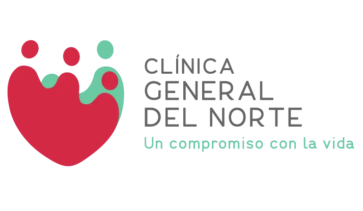

# Herramientas y Paquetes Utilizados


🛠 Herramientas de Desarrollo

Visual Studio 2022 (o superior)

.NET 6 / .NET 7

SQL Server

SQL Server Management Studio (SSMS)

📦 Paquetes NuGet Utilizados

A continuación, se detallan los paquetes necesarios para el correcto funcionamiento del proyecto:

1. Razor.RuntimeCompilation

Permite la  compatibilidad con compilación en tiempo de ejecución para vistas Razor y páginas Razor en ASP.NET Core MVC.

```cmd
Microsoft.AspNetCore.Mvc.Razor.RuntimeCompilation
```

2. System.Data.SqlClient

Permite la conexión directa con SQL Server mediante ADO.NET (en este proyecto se utiliza este enfoque).

```cmd
System.Data.SqlClient
```

Nota: En este proyecto se utiliza ADO.NET, no Entity Framework, por lo tanto, el paquete estrictamente necesario es System.Data.SqlClient.
